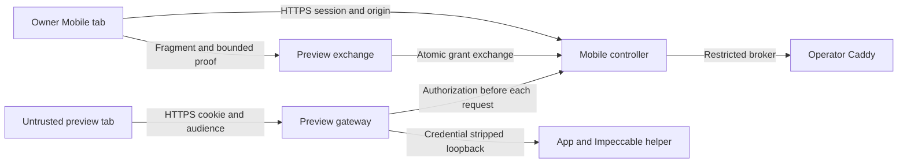

# Impeccable Live integration contract

Status: normative design for subsequent implementation; the existing Mobile
authentication controls described below are implemented. Live endpoints and
their negative examples are requirements, not evidence of working Live security.
L1 owns this document and fixtures only. Deployment and threat assumptions are
fixed by the authorized plan: operator-managed HTTPS/DNS/Caddy, untrusted project
content, one authenticated owner, exclusive relay/app ownership, and Codex-only
initial Live support. No additional deployment assumption is needed.

## ADR 1: origins and authorization

Example configured origins are `https://mobile.example.test` (Mobile, M) and
`https://preview.example.test:9443` (one preview, P). These are examples, not
defaults or inferred DNS. Normalize configured origins with the URL parser;
require HTTPS, no userinfo/path/query/fragment, and an explicitly bounded preview
port pool. Compare canonical scheme, hostname and effective port exactly.
Reject any preview whose hostname equals Mobile's hostname, even on a different
port: `400 LIVE_PREVIEW_HOST_CONFLICT`. Reject an app exposing the reserved
`/__gestalt_live/` namespace: `409 LIVE_HELPER_PATH_CONFLICT`. Capability readiness
also requires enabled production passkey auth; `--disable-passkey-auth` cannot
authorize Live (`503 LIVE_AUTH_UNAVAILABLE`).

Persist `(previewOrigin, canonicalAppRoot, appId)` before allocating a route.
An origin never transfers to another app, including after Stop, uninstall,
restart, pool edits or controller-state loss. Lost assignment records require
operator reconciliation, never allocation from an apparently empty pool.
Exhaustion returns `409 LIVE_ORIGIN_POOL_EXHAUSTED`. A returning app keeps its
origin; each run receives a new `liveId` and monotonically increasing generation.
This prevents retained service workers/storage from crossing app boundaries.
It does not protect an app from its own malicious code or old service worker.

### Existing Mobile evidence and cookie contract

`src/server/features/auth/http/cookies.ts`, `setAuthCookie`, currently sets
`HttpOnly; SameSite=Strict; Path=/`, omits Domain (host-only), and sets Secure
for HTTPS. Names/lifetimes are `gestalt_mobile_login` and
`gestalt_mobile_registration` (600 seconds each), and `gestalt_mobile_session`
(2,592,000 seconds). Preserve these names, RP-ID and credential database;
no passkey invalidation or recovery surface is authorized. Live requires the
HTTPS deployment of this existing contract.

`src/server/platform/http/authorization-boundary.ts` authenticates protected
`/api/` routes through `repository.sessionDevice(token, now)` and rejects
duplicate/empty session cookies. Unsafe methods require the exact configured
Mobile Origin before the handler, including public logout. Missing, `null`,
sibling, different-port and forged Forwarded/Referer origins return
`403 ORIGIN_NOT_ALLOWED`. Invalid Mobile sessions return `401 AUTH_REQUIRED`.
No CORS permission is added from preview to Mobile; SameSite alone is not CSRF
protection because sibling hosts/ports may be same-site.

| Credential       | Cookie / transport                                                                   | Audience and lifetime                                                                                                                  |
| ---------------- | ------------------------------------------------------------------------------------ | -------------------------------------------------------------------------------------------------------------------------------------- |
| Mobile session   | Existing `gestalt_mobile_session`; attributes above                                  | Mobile auth repository, authorized device; never sent upstream                                                                         |
| Launch grant     | 32 cryptographically random bytes, unpadded base64url; fragment only                 | One Mobile auth session/device, relayId, appId, liveId, generation, exact P and PKCE S256 challenge; 60 seconds, consumed once         |
| Browser verifier | 32 cryptographically random bytes, unpadded base64url, retained in Mobile tab memory | One launch popup and grantId; never persisted or placed in URL                                                                         |
| Preview lease    | `__Host-gestalt_live_p9443=<opaque 32-byte base64url token>`                         | Exact P/port, relay/app/live/generation, originating Mobile auth session/device; 300 seconds, absolute cap 3,600 seconds from exchange |

The preview cookie has `Secure; HttpOnly; SameSite=Strict; Path=/; Max-Age=300`
and no Domain. The name includes the effective port, preventing another preview
port's exchange from overwriting it; cookies themselves still cross ports.
Only the cookie named for the request's configured port is parsed, exactly once.
Its server record must match the full audience. A forged token, duplicate,
wrong-port, expired or revoked token returns `401 LIVE_AUTH_REQUIRED` uniformly.
Use opaque server-held records, not self-contained JWTs. Store hashes of grants
and lease tokens plus audience fields in private controller state, never in
project-readable `.gestalt/live` or `.impeccable/live` files. Tokens, verifiers,
Cookie/Set-Cookie/Authorization headers, and exchange bodies are redacted from
access/application logs, traces and metrics; identifiers may be logged.

Cookie scope is documented in [MDN's Set-Cookie reference](https://developer.mozilla.org/en-US/docs/Web/HTTP/Reference/Headers/Set-Cookie).
Host-only and HttpOnly restrictions do not provide a port boundary. The proxy
therefore removes the entire inbound Cookie and Authorization headers before
forwarding to the dev server/helper, plus any client-supplied identity/forwarded
headers; it writes its own fixed upstream identity headers. It strips all
upstream Set-Cookie headers, forbids credentialed CORS, and never returns
controller credentials in app responses. Initial fixtures must not depend on
application cookies or browser HTTP authentication. Application JavaScript can
set non-HttpOnly cookies shared across these ports; those cookies receive no
controller trust and are never forwarded. Cookie-dependent applications require
a later per-app-hostname design. The private upstream must be loopback-only and
unreachable from the remote browser/firewall; direct dev/helper listeners cannot
bypass the public authorization gateway.

### Request and sequence contract

All JSON bodies are strict objects (unknown fields rejected), at most 4 KiB.
IDs are opaque controller-issued identifiers, not paths or proxy URLs. All
control/exchange/authorization responses use `Cache-Control: no-store` and
`Referrer-Policy: no-referrer`. Failures use the existing
`application/problem+json` shape (`type`, `title`, `status`, `detail`, `code`,
`retryable`); never echo credentials. Preview authentication failures do not
redirect to an app or return any app bytes.

Wire timestamps (`expiresAt`, `leaseExpiresAt`, `absoluteExpiresAt`) are UTC
RFC3339 strings with millisecond precision; server time determines expiry,
including equality (expired at the deadline). Generation is a positive safe
integer. IDs are 1–128 ASCII letters/digits/underscore/hyphen; tokens/verifiers
are exactly 43 unpadded base64url characters. Canonical app identity and the
preview origin are looked up from ownership records, never accepted as arbitrary
launch request fields. `GET /api/sessions/:relayId/live` returns only the
authenticated owner's state and lease handles (`leaseId`, `liveId`, generation,
deadlines), never tokens/verifiers; unrelated owners receive 404
`LIVE_NOT_FOUND`. Mobile learns the newly exchanged leaseId here for renewal.
This safe Mobile endpoint still requires the existing session boundary.

| Step / endpoint                                                                                         | Request and checks                                                                                                                                                                                                                                                                                                                                                                    | Successful response                                                                                                                                                                    | Failure                                                                                                                                                                         |
| ------------------------------------------------------------------------------------------------------- | ------------------------------------------------------------------------------------------------------------------------------------------------------------------------------------------------------------------------------------------------------------------------------------------------------------------------------------------------------------------------------------- | -------------------------------------------------------------------------------------------------------------------------------------------------------------------------------------- | ------------------------------------------------------------------------------------------------------------------------------------------------------------------------------- |
| 1. Mobile launch: `POST /api/sessions/:relayId/live/launch-grants`                                      | Mobile session, exact M Origin; `{liveId,generation,codeChallenge,codeChallengeMethod:"S256"}`; challenge is 43-char base64url SHA-256 digest; current active owner and allocated app origin                                                                                                                                                                                          | `201 {grantId,grant,previewOrigin,exchangeUrl,expiresAt}`; exchangeUrl is P + `/__gestalt_live/auth#grant=<grant>&grantId=<grantId>`                                                   | 400 `LIVE_INVALID_REQUEST`; 401 `AUTH_REQUIRED`; 403 `ORIGIN_NOT_ALLOWED`; 404 `LIVE_NOT_FOUND` for another session/app; 409 `LIVE_NOT_ACTIVE` or `LIVE_GENERATION_STALE`       |
| 2. Browser opens trusted exchange document: `GET /__gestalt_live/auth`                                  | Only public HTML exception; no app content, external assets, helper editor, source or secrets; grant fragment never reaches HTTP                                                                                                                                                                                                                                                      | 200 tiny exchange document, pinned script hash CSP, `default-src 'none'; script-src 'sha256-…'; connect-src 'self'; base-uri 'none'; frame-ancestors 'none'; form-action 'none'`       | Unknown public namespace path 404; misconfigured origin 421 `LIVE_ORIGIN_MISMATCH`                                                                                              |
| 3. Proof handoff                                                                                        | Exchange script reads fragment and immediately `history.replaceState` removes it; requests `{type:"gestalt-live-proof",grantId}` from opener with exact M targetOrigin. Mobile verifies exact P event.origin, event.source === saved popup, matching unexpired grantId and unsent proof; replies once with `{type:"gestalt-live-proof",grantId,codeVerifier}` to exact P              | Verifier exists only in the two tabs' memory until exchange ack/60-second timeout; opener relationship severed before navigation to app                                                | No opener, blocked popup, wrong origin/source/id or timeout: stop; show “Reopen from Mobile”; never fall back to grant-only exchange                                            |
| 4. Exchange: `POST /__gestalt_live/exchange`                                                            | Exact P Origin, JSON `{grantId,grant,codeVerifier}`; no Mobile cookie required; verify SHA-256 proof, full audience, now < expiresAt, active owner generation and originating auth session/device still authorized. Atomically consume grant and create lease; invalid proof must not consume grant                                                                                   | 201 `{liveId,generation,leaseExpiresAt,absoluteExpiresAt}` plus preview cookie; popup acknowledges to Mobile, both erase verifier, sever opener and replace navigation with `/`        | 400 `LIVE_INVALID_REQUEST`; 403 `ORIGIN_NOT_ALLOWED`; 401 `LIVE_GRANT_INVALID` uniformly for stolen/no-proof, unknown, replay, expired, wrong audience or owner loss; no cookie |
| 5. Proxy any app/helper request, including HEAD/OPTIONS, source maps, assets, SSE and WebSocket upgrade | Resolve exact configured host/port independently of untrusted forwarded headers; check selected lease record/current auth device/session/current active ownership/generation before connecting upstream. Unsafe methods and every WS upgrade require exact P Origin. Reject cross-origin fetches (no CORS); navigation may omit Origin; allow absent Origin only on safe non-WS reads | Pass authorized app/helper response (including 101 only after authorization), strip credential headers; private auth check `204` is never a public bypass                              | 401 `LIVE_AUTH_REQUIRED`; 403 `ORIGIN_NOT_ALLOWED`; 421 `LIVE_ORIGIN_MISMATCH`; unavailable owner store 503 `LIVE_AUTH_UNAVAILABLE`, never fail open                            |
| 6. Renew from authenticated Mobile: `POST /api/sessions/:relayId/live/leases/:leaseId/renew`            | Exact M Origin and same originating auth session/device, active owner/live/generation; `{liveId,generation}`. leaseId is a non-secret handle returned only to Mobile launch status, not app code; now < lease expiry and absolute cap                                                                                                                                                 | 200 `{leaseExpiresAt,absoluteExpiresAt}`, deadline min(now + 300s, exchangedAt + 3600s); no automatic project-driven extension                                                         | 404 `LIVE_NOT_FOUND` for unrelated lease; 401 `AUTH_REQUIRED`; 409 `LIVE_LEASE_EXPIRED` or `LIVE_GENERATION_STALE`                                                              |
| 7. Refresh cookie: `POST /__gestalt_live/lease`                                                         | Exact P Origin, valid existing preview cookie; `{}`. Cannot extend server deadline; checks current authorization and same full audience                                                                                                                                                                                                                                               | 200 `{leaseExpiresAt,absoluteExpiresAt}`, cookie Max-Age = remaining server lease seconds (rounded down)                                                                               | 401 `LIVE_AUTH_REQUIRED`; 403 `ORIGIN_NOT_ALLOWED`                                                                                                                              |
| 8. Stop: `POST /api/sessions/:relayId/live/stop`                                                        | Exact M Origin, owner auth; `{liveId,generation}`; control remains usable without a model turn                                                                                                                                                                                                                                                                                        | 202 while draining after revocation barrier; terminal 200 only after verified cleanup and state idle; recoveryRequired/error retains ownership and cannot report completed Stop        | Normal Mobile auth/origin errors; stale generation 409 `LIVE_GENERATION_STALE`                                                                                                  |
| 9. Logout / device revoke                                                                               | Existing `POST /api/auth/logout` and `DELETE /api/auth/devices/:deviceId`; preserve current 204 and final-device 409 semantics                                                                                                                                                                                                                                                        | 204 only after authoritative session/device revocation; invalidate all matching grants/leases across relays and actively close their streams; browser cookie clearing is supplementary | Existing `LAST_DEVICE_REQUIRED` means no revocation happened; controller loss fails closed for preview checks                                                                   |

Launch is initiated by a user click that opens a saved popup synchronously;
Mobile then mints the grant and navigates that popup. COOP policy on Mobile and
exchange page must preserve the bounded postMessage relationship; later browser
tests must prove it with actual deployed headers. A copied URL on another device
cannot supply the tab-held verifier; the user must authenticate and Open there.
This proof prevents theft of a fragment alone; compromise of the owner Mobile
tab/browser or the app's own origin remains outside this guarantee. Do not
advertise a grant as safe when grant and verifier have both been stolen.

Mobile may renew while its owner tab is active, no more often than once per
60 seconds per lease, and only for its own still-live auth session. Renewal
does not revive expired leases; after 3,600 seconds require a new authenticated
Open with new grant/proof. Preview refresh cannot renew itself. Return
`429 LIVE_RATE_LIMITED` with `Retry-After: 60` for launch/renew/exchange after
10 attempts per minute per owner (unauthenticated exchange additionally per
peer IP), without logging grants. Automatic refresh before cookie expiry may
read a renewed server deadline; backgrounded browser failure expires safely.

### Cross-origin resource boundary

Cookie audiences alone are insufficient when one browser holds leases for two preview ports. For every safe non-navigation app/helper request, require `Sec-Fetch-Site: same-origin` and reject foreign or absent browser Fetch Metadata with `403 LIVE_CROSS_ORIGIN_REQUEST`; if Origin is present it must also equal P. Top-level safe navigation may omit Origin but requires `Sec-Fetch-Mode: navigate`, `Sec-Fetch-Dest: document` and a valid lease; iframe navigation is denied. Set `Cross-Origin-Resource-Policy: same-origin` and a gateway-owned `frame-ancestors 'none'` CSP policy on proxied responses. This prevents a malicious app or sibling from loading another preview port's scripts/images/iframe with ambient cookies. App CSP may add restrictions but cannot remove this independent gateway policy. The public exchange document is the narrow navigation exception already specified above. Non-browser test clients must supply the required request metadata; those headers are browser isolation defenses, never substitutes for grant/lease authorization. No wildcard or credentialed CORS permission is allowed. Named later test `preview-cross-origin-resource-denial` must exercise two live app ports in one authenticated browser, including script/image/iframe loads and absent-Origin requests.

### Revocation and streams

Stop, owner loss, generation change, originating Mobile session expiry/logout,
device revocation, preview lease expiry or absolute deadline revokes the grant
and lease records first. New requests/handshakes reject immediately. Every SSE,
WS and streaming HTTP connection is registered by lease/live/generation before
forwarding, has a timer for min(leaseExpiresAt, absoluteExpiresAt, openedAt +
60 seconds), and revalidates owner/auth at least every 5 seconds. Renewal cannot
extend an already-open stream past its 60-second deadline. Revocation actively
closes registered connections before Stop succeeds; stale worker callbacks
cannot reopen them. WS uses close code 1008; SSE/HTTP streams end without app
bytes after revocation. An already delivered response cannot be recalled;
no new chunks or writes may start after the revocation barrier. Disconnect,
restart and background/resume must retain Impeccable's canonical poll semantics;
stream reconnection is not permission to restart an edit or abandon its journal.

### System model and threat boundaries

Assets are Mobile session/passkey confidentiality, source/journal integrity,
exclusive writer ownership, preview grant/lease secrecy, stable origin records,
and operator Caddy configuration/availability. Remote attackers can send forged
requests, know origins/paths, replay a stolen fragment, control sibling content
and untrusted app code, or run project processes/tools under the agent UID.
They are not assumed to compromise operator root, the Mobile origin, the private
controller store, or the browser itself. Tests must challenge same-UID access;
filesystem socket permissions alone do not establish that boundary.

| Threat | Abuse path / boundary                                                        | Existing control                                                           | Required control / named later test                                                                                                                         | Risk                                                                                               |
| ------ | ---------------------------------------------------------------------------- | -------------------------------------------------------------------------- | ----------------------------------------------------------------------------------------------------------------------------------------------------------- | -------------------------------------------------------------------------------------------------- |
| TM-001 | Preview/sibling sends cookie-backed mutation to Mobile, edits another relay  | Exact Origin and opaque session checks in `authorization-boundary.ts`      | Preserve host-only cookies; no preview CORS; `mobile-origin-cookie-boundary` actual-browser sibling/different-port case                                     | High: plausible same-site request, high source/control impact                                      |
| TM-002 | Fragment theft races legitimate exchange or replay crosses relay/port        | Live not implemented                                                       | PKCE, atomic consume, exact audience, 60s deadline; `launch-grant-proof-replay-audience`                                                                    | High: bearer URL exposure plausible, preview/source exposure high                                  |
| TM-003 | Anonymous source/asset/HMR/SSE path bypasses HTML-only check                 | Live not implemented                                                       | Gateway before all routes and stream opens; `preview-all-paths-auth` and `preview-stream-revocation`                                                        | High: direct network request easy, project confidentiality high                                    |
| TM-004 | Stop/logout leaves a WS writer connected or old generation valid             | Existing auth repository revokes Mobile sessions/devices; no Live hook yet | Barrier and registry close; timers; `preview-stream-revocation` plus `owner-generation-revocation`                                                          | High: normal lifecycle makes this likely without controls, source integrity high                   |
| TM-005 | Same-UID project process edits Caddy to bypass gateway/affect existing sites | Operator Caddy is external; isolation not established                      | Restricted Unix admin socket via separately authorized broker or verified managed boundary; deny actual agent/project process; `caddy-admin-project-denial` | High: same UID defeats mode bits, auth bypass/config impact high                                   |
| TM-006 | Old service worker receives another app or project cookies cross ports       | No Live origin allocation yet                                              | Never recycle app origin; strip all proxy cookies; cookie-independent initial app contract; `stable-app-origin-allocation` and `proxy-credential-stripping` | High: retained browser state realistic, cross-app confidentiality high                             |
| TM-007 | Brute force or flood consumes grants/port pool and logs credentials          | Existing Mobile opaque auth; Live limiter absent                           | Entropy, bounded pool/body/attempts, credential redaction; `preview-limit-and-redaction`                                                                    | Medium: network flood plausible, availability impact bounded; secret logging would elevate to high |

Caddy admin has no browser HTTP endpoint, no loopback TCP fallback, and no raw
agent-tool capability. The chosen broker/managed boundary must deny socket
connection from the actual effective project/agent process, not merely a test
UID. Readiness returns `503 LIVE_CADDY_ADMIN_UNISOLATED` until this is proved.
The broker accepts only authenticated controller operations against namespaced
Gestalt route IDs/ports/loopback targets; it cannot accept arbitrary Caddy JSON.
Operator bootstrap remains manual. Caddy supports a Unix admin address, but
its [admin API](https://caddyserver.com/docs/api) and
[admin configuration](https://caddyserver.com/docs/caddyfile/options#admin)
do not themselves prove same-UID isolation. L4/L6 must supply the implementation
and actual-process denial evidence; this ADR is not that proof.

Runtime threat coverage is distinct from CI fixtures: contract JSON cases below
express expected outcomes; passing fixture validation cannot establish gateway,
TLS, broker or browser isolation. Focus review on Mobile cookie/boundary files,
auth logout/device revoke endpoints, `app.ts` registration ordering,
`composition.ts` concrete wiring, and future `features/live-design` slices and
`platform/live-design` adapters. Only composition constructs external adapters;
each HTTP use case owns its request/response schema and registration entrypoint.

## Authorization examples and evidence matrix

Machine-readable cases: `test/contracts/live-authorization.json`. Current
focused checks exercise actual existing Mobile cookie serialization and Origin
rejection; Live cases remain named requirements for L5/L6/L11 production tests.

| Case                                                                                      | Expected result                                                                             | Required later evidence                                             |
| ----------------------------------------------------------------------------------------- | ------------------------------------------------------------------------------------------- | ------------------------------------------------------------------- |
| Anonymous `/`, `/src/App.svelte`, source map, JS, helper editor, SSE, HMR WS              | 401 before upstream; no app bytes / no 101                                                  | `preview-all-paths-auth`                                            |
| Grant without correct browser proof, replay, age >=60s, other session/app/generation/port | 401 `LIVE_GRANT_INVALID`, no lease cookie                                                   | `launch-grant-proof-replay-audience`                                |
| Two valid simultaneous exchanges                                                          | Exactly one 201; other 401                                                                  | `launch-grant-proof-replay-audience`                                |
| Lease on another preview port or old generation                                           | 401 `LIVE_AUTH_REQUIRED` despite browser sending cookies across ports                       | `owner-generation-revocation`                                       |
| Preview configured on Mobile host at another port                                         | 400 `LIVE_PREVIEW_HOST_CONFLICT`, no route/grant                                            | `mobile-origin-cookie-boundary`                                     |
| Sibling host cookie request / duplicate Mobile cookie / forged Origin                     | Host-only cookie absent at sibling; duplicated session fails 401; unsafe foreign Origin 403 | `mobile-origin-cookie-boundary` real browser and current unit check |
| Stop/logout/device revoke/lease deadline during HMR and SSE                               | Close owned streams, reject next request/handshake; no revived lease                        | `preview-stream-revocation`                                         |
| Renewal by wrong owner, expired lease or after absolute cap                               | 404 / 409, no extension; preview refresh alone cannot extend                                | `preview-lease-renewal`                                             |
| Project process tries Caddy socket via client/tool or dev server                          | OS/managed boundary denial; capability stays unready without proof                          | `caddy-admin-project-denial`                                        |
| Malicious app response sets cookie or upstream sees credentials                           | Set-Cookie stripped; upstream gets neither Mobile nor preview nor app cookies/Authorization | `proxy-credential-stripping`                                        |
| Reallocate stopped origin to another app / reload loses routes                            | Reallocation rejected; owner remains blocking until reconciliation                          | `stable-app-origin-allocation`                                      |

Remaining implementation evidence is deliberately assigned to later milestones;
no security gate is waived by this contract. ADR 2 defines authoritative state
and dispatch mapping; ADR 3 records compatibility and current baseline results.

## ADR 2: one authoritative ownership state

Live lifecycle is separate from `RelaySession.state` and Autopilot's state.
`LiveOwnershipStore` is the single authoritative owner, implemented later as a
private SQLite database `live.sqlite` in the operator's private Mobile controller
state directory, shared by every Mobile relay process using that controller.
It must remain outside project-readable workspaces. `composition.ts` currently
constructs session, journal and Autopilot stores against a per-relay
`relay.sqlite`; those snapshots cannot alone arbitrate two relays using different
data directories. The new ownership adapter belongs in
`src/server/platform/live-design`; narrow domain/application ports and use cases
belong in `src/server/features/live-design`. The UI, Caddy, Impeccable files,
process liveness and Org plan are projections, never ownership authorities.

All installed Mobile instances must use this shared controller identity/store;
multiple independent controllers targeting the same app are unsupported and
must fail readiness. One OS-enforced controller broker/lock prevents unmanaged
duplicate controller state; configuring a different data-dir cannot bypass it.
Workspace `.gestalt/live/<liveId>.json` contains only non-secret diagnostic
references and can be regenerated. No auth secret, mutable lock or authorization
decision is read from a project file. A corrupted/unavailable ownership store
fails dispatch and preview authorization closed with `503 LIVE_STATE_UNAVAILABLE`.

### Durable record and invariants

| Field                                             | Exact meaning                                                                                                                                                                                                |
| ------------------------------------------------- | ------------------------------------------------------------------------------------------------------------------------------------------------------------------------------------------------------------ |
| `version`, `revision`                             | Schema version 1; positive compare-and-swap record revision, incremented for every state mutation                                                                                                            |
| `liveId`, `generation`                            | Opaque run ID; never-reused positive fence from persistent controller counter; generation survives app/relay row removal                                                                                     |
| `controllerId`, `controllerEpoch`                 | Durable installation ID and fencing epoch assigned by shared-store reconciliation; an old process cannot continue side effects after takeover                                                                |
| `relayId`, `rootThreadId`, `provider`             | Existing relay and Codex thread identity; provider must be codex, never silently switch Kimi                                                                                                                 |
| `appId`, `canonicalAppRoot`, `appIdentity`        | Registry ID; realpath plus device/inode or equivalent stable platform identity; revalidate before every edit/launch; replacement or symlink retarget requires recovery                                       |
| `ownerAuthSessionId`, `ownerDeviceId`             | Original owner references in existing private auth DB; validate current authorization, never copy raw Mobile cookie                                                                                          |
| `state`, `phase`, `failureCode`                   | State from table below; phase identifies last durable intent/ack for restart; bounded safe error code, no prompt/output                                                                                      |
| `targetId`, `targetIdentity`                      | Registered loopback dev target and verified listener identity; arbitrary proxy URLs forbidden; dev server is external unless process ownership is proved                                                     |
| `previewOrigin`, `originAssignmentId`, `routeIds` | Stable app origin and only namespaced Gestalt route IDs; retain assignment forever; ack includes Caddy configuration revision/hash                                                                           |
| `processes`                                       | Owned helper/poll/runtime command IDs, OS PID, process start identity, parent/controller epoch, executable digest and ownership kind; PID alone is insufficient; registered dev server is not kill authority |
| `pollOwner`, `inflightEvent`                      | One canonical CLI poll lease owner and event ID/status; persist issued intent before action and accepted/completed ack; transport uncertainty never retries blindly                                          |
| `journalRefs`, `reconciliation`                   | Verified canonical `.impeccable/live` journal references, pending accept/discard/write operations, reconciliation outcomes; never delete source journals on Stop                                             |
| `priorControls`, `suspensionFence`                | Prior Autopilot requestedEnabled/state/generation/planIdentity plus manual intent revision; suspension generation, cancelled control IDs, wait/checkpoint references; captured before suspension             |
| `pendingControlIntent`                            | Latest manual Off intent with monotonic revision; optional explicit post-Stop Resume request; live owns suppression but never overwrites user's newer choice                                                 |
| `createdAt`, `updatedAt`, `operationId`           | Server RFC3339 UTC timestamps; client idempotency operation bound to owner/relay/app/body; no prompt text                                                                                                    |

Unique non-idle claims exist for both relayId and canonical app identity.
Acquire both in one `BEGIN IMMEDIATE` transaction; any conflict rolls back the
whole claim. Ordinary dispatch reservations share this store and canonical app
scope, so a turn racing Start either reserves first (Start returns busy) or
loses to the Live claim (turn returns `409 LIVE_MODE_ACTIVE`). Normal writers
whose effective write scope contains/intersects the app (including a parent
workspace or symlink alias) also conflict; do not equate different path strings
with isolated apps. Unknown effective scope or stale activity is busy, not idle.
File identity and canonical write scopes are registry/controller facts; clients
cannot choose narrower fake scopes. Unrelated app roots remain independently
usable only when effective writer permissions prove no overlap.

Ordinary writer reservations remain until the entire root/descendant/background
process tree is quiescent and all issued commands/approvals are settled. A
stopped root turn alone is insufficient. Neither process timeout nor missing
heartbeat releases claims; reconcile actual runtime/process ownership first.
Use durable intent/ack phases for out-of-transaction Caddy/process/provider IO.
The store transaction commits no external IO; the adapter must recheck the
fence immediately before and after each await. Any accepted-but-unacknowledged
provider/process action moves to recoveryRequired with ownership retained.

### Lifecycle and HTTP outcomes

All non-idle states retain both claims and block ordinary dispatch, including
error. Only explicit controller reconciliation releases them. State updates
require matching liveId, generation, controllerEpoch and expected revision.
Mismatch returns `409 LIVE_GENERATION_STALE` without changing either new owner
or old resources; an old callback cannot remove a new route/process.

| From                           | Event / guard                                                                                                     | To               | Observable result and durable consequence                                                                                                              |
| ------------------------------ | ----------------------------------------------------------------------------------------------------------------- | ---------------- | ------------------------------------------------------------------------------------------------------------------------------------------------------ |
| idle                           | Start; supported provider/capabilities; registered app/target; no conflicting dispatch or ownership               | starting         | 202; atomic relay/app claim + operationId + controls snapshot before external side effects                                                             |
| idle                           | Start while root/child/terminal/approval/dispatch/recovery busy or activity unknown                               | idle             | 409 `LIVE_SESSION_BUSY`; no claim, grant, process or route; user can interrupt existing work then retry explicitly                                     |
| idle                           | Start while another relay owns app                                                                                | idle             | 409 `LIVE_APP_BUSY`; transactional rollback leaves requested relay unclaimed                                                                           |
| starting                       | Suspend control acknowledged; all prerequisites, helper, poll owner, protected routes healthy with current fences | active           | Publish active status; only now allow launch grant and Live dispatch                                                                                   |
| starting                       | Stop on same current run                                                                                          | stopping         | 202; persist cancellation and revoke first; any late start ack must be cleaned under the same fence, never publish active                              |
| starting                       | Definitive prerequisite failure, no IO may be pending                                                             | error            | Keep claim; record reason and deterministic cleanup work; no preview/model access                                                                      |
| starting/active/stopping/error | Restart, controller/runtime/helper loss, ambiguous IO or mismatched observed resources                            | recoveryRequired | Revoke preview, suspend automatic dispatch; preserve claims/journal/operation intent; expose Resume/Stop/diagnosis                                     |
| active                         | Stop or owner loss/lease-independent session logout/device revoke                                                 | stopping         | Revoke grants/leases/streams first; stop accepting poll/edit events; interrupt and drain owned Live edit work                                          |
| active                         | Helper exit or failed canonical edit/accept reconciliation                                                        | recoveryRequired | Access revoked and journal retained; no automatic replay or discard                                                                                    |
| stopping                       | Owned edits/processes/streams drained, routes verified removed, journal reconciled, control suspension settled    | idle             | 200 completed result; release both claims atomically; origin assignment remains; normal chat is available                                              |
| stopping                       | Cleanup fails definitively                                                                                        | error            | Retain both claims; 503 `LIVE_CLEANUP_REQUIRED` and retryable Stop/diagnosis; never claim stopped                                                      |
| error                          | Explicit Stop/retry-cleanup                                                                                       | stopping         | 202; repeat only idempotent verified cleanup actions; never restart edits                                                                              |
| recoveryRequired               | Explicit Resume after owner auth, app/target/process/journal/control reconciliation proves healthy                | active           | 200; new generation/controller fence, renewed poll ownership; old grants/leases invalid; require fresh Open                                            |
| recoveryRequired               | Explicit Stop; reconciliation cannot safely resume                                                                | stopping         | 202; preserve unresolved journal; clean only verified owned resources                                                                                  |
| idle                           | Duplicate completed Stop operationId                                                                              | idle             | 200 original completion acknowledgement; no control restore twice                                                                                      |
| any non-idle                   | New Start operationId                                                                                             | unchanged        | 409 `LIVE_MODE_ACTIVE` for same relay, `LIVE_APP_BUSY` for other relay; same valid original Start retry returns recorded progress without repeating IO |
| any                            | Old generation/revision/epoch event, wrong owner or foreign app                                                   | unchanged        | 409 stale fence / 404 `LIVE_NOT_FOUND`; no side effect                                                                                                 |

Unknown transitions reject `409 LIVE_STATE_CONFLICT`. There is no automatic
error-to-idle, recoveryRequired-to-starting, expiry-to-idle or restart-to-active.
An idle row is a completed record, not permission to recycle its origin.

`POST /api/sessions/:relayId/live/start` accepts strict `{appId,targetId}` and
required `Idempotency-Key`; the controller creates liveId/generation. Busy
Start does not auto-interrupt an active writer or retain the start as a queue.
`GET /api/sessions/:relayId/live` exposes state, phase, safe failure code,
app/target/origin identity, generation and owner-scoped lease handles plus
available actions; it contains no secrets, prompt or model output.
`POST /api/sessions/:relayId/live/resume` and `/stop` accept strict
`{liveId,generation}`, required `Idempotency-Key`, owner session and exact M
Origin. Same key/different body returns 409 `IDEMPOTENCY_KEY_REUSED`; replay
never skips current auth, ownership or generation validation. Resume changes
generation atomically before side effects and invalidates previous leases;
failure retains recoveryRequired. Stop may return 202 while draining, with
`{liveId,generation,state:"stopping"}`; terminal 200 contains state idle.
No model response is needed for these controls. Generic session Stop/release
must invoke this same Live cleanup path first; forget cannot erase ownership.

### Dispatch inventory at Mobile base f5e0133

Every row below is an actual existing entry point except the explicitly future
Live event row. These are required later L7 gate locations, not claims of
currently implemented Live exclusion. Relative paths below are under
`src/server/` unless prefixed `src/shared`. `composition.ts` remains the sole
concrete constructor; gate dependencies must be wired into slices and adapters,
not obtained from a service locator. The final provider boundary is mandatory
even when upstream caller policy already denies work.

| Entry point / concrete anchor                                                                                                                                                                                        | Existing downstream effect                                                                                   | Required Live gate                                                                                                                                                                                                                                                                        |
| -------------------------------------------------------------------------------------------------------------------------------------------------------------------------------------------------------------------- | ------------------------------------------------------------------------------------------------------------ | ----------------------------------------------------------------------------------------------------------------------------------------------------------------------------------------------------------------------------------------------------------------------------------------- |
| `POST /api/sessions/:id/turns`; `features/sessions/start-turn/endpoint.ts`, `startWithWriter`; composition `sessionRoutes.startTurn` / `ensureWriter`                                                                | Writer acquisition then runtime start; existing per-route serialization and idempotency                      | Before accepting/caching a new ordinary prompt, before ensureWriter, and at provider dispatch. Return 409 `LIVE_MODE_ACTIVE`, no prompt queued or history message created; cached old 202 cannot imply a new dispatch                                                                     |
| `POST /api/sessions/:id/turns/:turnId/queue`; `features/sessions/queue-turn-input/endpoint.ts`; composition `queueTurnInput`                                                                                         | `runtime.queueTurnInput` -> Codex `turn/steer`                                                               | Same ordinary gate; reject 409 rather than storing “send later”, including steering an active Live turn                                                                                                                                                                                   |
| `features/autopilot/application/service.ts`, `fire` -> `AutopilotTurnStarter.start`; composition `turnStarter.start`                                                                                                 | `ensureWriter`, synthetic root `runtime.startTurn`                                                           | Suppress scheduled and issued continuations under non-idle Live owner; cancel old control fence, no hidden queue; check before/after writer await and before turn/start                                                                                                                   |
| Same service `enforceSupervisedLifecycle`/executor command dispatch -> `SupervisedExecutorController.resume`; composition `executorController.resume`                                                                | `runtime.startExecutorTurn`; missing-child one-time thread/resume and retry                                  | Gate all partial/process-result/resource-limit/checkpoint-triggered executor continuations and retry; Live never resumes an old Org executor                                                                                                                                              |
| Plan signals: composition `acceptPlanUpdate`, `planStatusSource.attach` callbacks, `autopilot.supervisionStarted`; `features/plans/open-plan/endpoint.ts` (`PUT /api/sessions/:id/plan`) and close/archive endpoints | Observe/change plan identity, enable or wake Autopilot                                                       | Reads/status refresh allowed; attachment/replacement/close/archive changing retained control identity rejected 409 during Live; late watcher signals may update diagnostics but cannot enable or issue a turn                                                                             |
| `PUT /api/sessions/:id/autopilot`; `features/autopilot/toggle/endpoint.ts`, coordinator `enable`/`disable`                                                                                                           | User intent and automatic control generations                                                                | Off always allowed and persisted; On returns 409 `LIVE_MODE_ACTIVE`, no queued enable. Internal signal is not manual On; no automatic restore from old snapshot                                                                                                                           |
| `POST /api/sessions/:id/interactions/:requestId`; `features/sessions/respond-interaction/endpoint.ts`; composition `replyInteraction`; runtime `resolveServerRequest`                                                | Answers approval/quiz/user-input/attention and can release blocked model/tool work                           | Accept only interaction proven to belong to current authorized Live turn and fence. Reject old ordinary/Org approval 409; denial/interrupt that safely cancels old work remains allowed during pre-Start quiescence                                                                       |
| Dynamic `item/tool/call`; `platform/codex/server-request.ts` and composition runtime request callback                                                                                                                | Quiz, `gestalt_org_plan_attention`, checkpoint, wait lease, capacity recovery; health handled as observation | Observe health allowed. Org checkpoint/wait/attention/replacement/capacity mutation from ordinary or stale turn denied `LIVE_MODE_ACTIVE`; responses cannot schedule Org work while Live owns. Live tools cannot self-enable supervision                                                  |
| Composition checkpoint timeout `failCheckpointHandoff` recycle, `armAttentionAcknowledgementDeadline` recycle and `scheduleAgentCapacityRecovery`; runtime `recycle`                                                 | Drops/reconstructs writer; later control recovery can continue                                               | Recheck ownership/fence inside delayed callback, before recycle and after await; no ordinary runtime reconstruction under Live. Route recovery to Live reconciler; stale callback cannot save old ready snapshot                                                                          |
| `POST /api/sessions/:sessionId/debug`; `features/self-debug/endpoint.ts`, `create-session.ts`; composition `askSource` and debug `startTurn`                                                                         | Steers/starts source session, starts separate debug Codex session                                            | During Live allow bounded controller diagnostics only; reject model-driven debug request for owned source/app 409. A new debug session cannot write an overlapping app root                                                                                                               |
| `POST /api/sessions`; `features/sessions/start-session/endpoint.ts` / `use-case.ts`; composition `activate`                                                                                                          | `runtime.start` constructs app-server/thread (Kimi own runtime separately)                                   | New unrelated session remains possible, but acquire write-scope reservation before writer activation. Reject overlapping app claim; never launch Codex for Kimi Live                                                                                                                      |
| `POST /api/sessions/recent-threads/open`; `features/sessions/promote-recent-thread/endpoint.ts` and `use-case.ts`; composition `promoteRecent`                                                                       | Promotes detached history into session, may later acquire writer                                             | Read history allowed; promotion cannot acquire an overlapping writer or bypass relay/app claim; promotion of owned root cannot create duplicate ownership                                                                                                                                 |
| `POST /api/sessions/:id/restore`; `features/sessions/restore-session/endpoint.ts`; composition `restore` -> `restoreWithOutcome`; `SessionSupervisor` callback in composition                                        | Resumes thread or replaces missing rollout; persists ready session                                           | Ordinary restore rejected 409 for non-idle owner. Live Resume is sole recovery path; missing rollout cannot silently replace Live owner/journal or release app claim                                                                                                                      |
| `platform/codex/session-runtime.ts`: `start`, `ensureWriter`, `restoreWithOutcome`, `acquireWriter`, `startTurn`, `startExecutorTurn`, `queueTurnInput`, `verifyRetrieval` fallback                                  | All writer/resource creation, thread/start/resume and turn/start/steer RPCs                                  | Last outbound boundary validates controller-issued dispatch reservation or current Live event capability, full generation/epoch and app write scope; repeat before fallback/resume/retry. Client-supplied “live” flag/ID cannot bypass                                                    |
| Runtime `listDirectChildren` -> `withResolvedChildModels` and detached topology/history/activity reads; get-history/activity-refresh routes                                                                          | Model recovery performs `thread/resume` even though caller looks read-only                                   | Bounded thread/read/list may observe; skip model-recovery resume of old children during Live, return unknown model. Any thread/resume requires the same ownership gate; activity read is never writer acquisition                                                                         |
| Codex model-native collaboration/command/file tools, observed `collabAgentToolCall` / `collabToolCall` in runtime `resolveNotificationOrigin`                                                                        | Can spawn/continue children and background commands inside an accepted turn without another Mobile route     | Quiesce all old descendants/processes first. Initial Live dispatch disables spawn/followup and external agent execution under effective managed permissions; no independent writers. If actual runtime cannot enforce this restriction, capability unready, not an HTTP-only safety claim |
| `POST .../turns/:turnId/interrupt`, session `/stop`, `/release`, `DELETE /api/sessions/:id`; associated feature endpoints, composition `close`/`remove`                                                              | Interrupts/releases runtime; forgetting removes session state                                                | Interrupt/Stop allowed without model; current owned identity required. Stop/release first run Live revocation/drain/reconciliation; forget rejected `409 LIVE_CLEANUP_REQUIRED` until idle. Never remove blocking owner to hide cleanup failure                                           |
| `POST /api/sessions/:id/model`; `features/sessions/select-model/endpoint.ts`                                                                                                                                         | Changes next-turn provider-local model setting                                                               | Reject during non-idle Live to keep inherited model/effort/permissions deterministic; readonly model catalogs allowed                                                                                                                                                                     |
| Future canonical Live poll/event dispatcher in `features/live-design`                                                                                                                                                | Generate/steer/prefetch/manual_edit_apply/accept/discard and upstream acknowledgement/verification           | Sole event dispatcher with valid Live generation, active owner, single poll lease and event ID. Event acceptance does not permit unrelated root/Org turn. Stop prevents new events and drains already-issued edits                                                                        |

The Kimi outbound equivalents also require ordinary app-scope gating: `platform/kimi/kimi-session-runtime.ts` `start`, `ensureWriter`, `restoreWithOutcome`, `startTurn`, `queueTurnInput`, `resolveServerRequest`, `submitPrompt`, and reconnection/profile callbacks. Normal Kimi remains usable for unrelated scopes; a Kimi session cannot acquire or bypass a Codex Live app claim. Live Start itself returns `409 LIVE_PROVIDER_UNSUPPORTED` for Kimi without constructing a Codex process.

The explicit ordinary error is `409 LIVE_MODE_ACTIVE`, including starting,
stopping, error and recoveryRequired. Validate Mobile auth/Origin first; another
owner receives 404 without learning private state. Error bodies describe the
safe action (“Stop or reconcile Live before sending”) through the existing
toast pipeline. No ordinary text enters a server/client delayed queue, and
UI input must show a rejected send rather than a pending bubble. Existing
idempotency results do not replace current gate/auth checks.

The runtime reservation includes caller class (`ordinary`, `autopilot`, `org`,
`selfDebug`, `liveEvent`), allowed app scope, liveId/generation/epoch when Live,
and provider operation ID. It is created in-process by trusted composition,
never accepted from browser/tool JSON. Normal dispatch and Start share the
transactional claim boundary. Reservations must be retained across provider
acceptance uncertainty and released only at safe quiescence. External editors
or shells outside managed Gestalt permissions are outside the enforceable
session promise; readiness must fail if project processes can start an unmanaged
writer with broader effective authority.

### Autopilot suspension and deterministic recovery

Current `AutopilotSession` (`features/autopilot/domain/autopilot-session.ts`)
stores requestedEnabled, generation, planIdentity, lastControlId and stopReason.
Current `disable` increments generation and persists manualDisabled;
`supervisionStarted` explicitly respects manual Off for the same retained plan.
Live must preserve that behavior, not use `enable` as a restoration shortcut. The reference fixture's `ControlIntent.enabled` means desired user intent, not the temporarily suspended scheduler state; suspension alone does not change that intent or its manual revision.

1. Atomic Live claim records priorControls and a suspension intent. The dispatch
   gate immediately blocks all ordinary/automatic starts even if the existing
   Autopilot store has not yet acknowledged suspension. A fenced idempotent
   suspension operation cancels timers/scheduled controls/wait continuations,
   advances the Autopilot generation and records its acknowledged generation.
   Do not call generic manual `disable` to impersonate a user action.
2. Manual Off during Live always persists requestedEnabled false,
   manualDisabled, and a newer manual intent revision, even if suspension has
   already turned scheduling off. Replay of an older On response does not change
   this intent. On while Live is rejected; it does not become pending intent.
3. Stop never restores an enabled snapshot wholesale. After cleanup, restore
   only the non-secret prior control metadata when retained planIdentity and
   suspensionFence still match and no newer manual intent exists. Automatic
   continuation remains off. Response exposes `resumeAvailable:true` only when
   prior intent was enabled, plan identity still matches, and no manual Off,
   safety pause, attention, failed handoff or session-end invalidates it.
4. The user explicitly chooses Resume Autopilot through existing toggle On
   after Live is idle; this creates a new generation/evaluation, never replays an
   issued control, wait lease or checkpoint final. If manual Off was recorded,
   `resumeAvailable:false` and it remains Off until a later explicit On. No
   Live Resume/Stop, watcher signal or restart can overwrite that choice.

Live Resume is distinct from Autopilot Resume and never enables Autopilot.
On relay restart, scan all non-idle records before serving dispatch/preview;
fence prior controller processes, revoke access, reconstruct diagnostic state
and mark recoveryRequired. Reconcile actual helper/poll/process/route identities,
app identity, originating auth, journal pending actions and controls. Default to
Stop when ownership/journal consistency cannot be proved; do not accept/discard
or kill an external dev server to make the state appear clean. Process identity
ambiguity retains error/recoveryRequired and both claims. If resuming is proven
safe and the user explicitly requests it, mint a new generation, launch only
missing verified owned components and preserve canonical poll acknowledgements;
fresh Open authenticates the browser again. Completed cleanup releases claims
and retains journal/origin assignments and manual Off intent.

### State contract verification

`test/contracts/live-ownership.ts` is a small executable reference contract,
not a production controller. It fixes the allowed transition relation and
SQLite atomic uniqueness/CAS behavior; the table and race tests exercise this
reference with two connections to one isolated temporary DB. L7 must run the
same semantic cases through actual feature/runtime ports and real concurrency.
Required named tests are `live-transition-table`, `live-start-dispatch-race`,
`live-two-relay-app-claim`, `live-generation-restart-fence`,
`live-stop-during-start`, `live-manual-off-restore`, and
`live-dispatch-entrypoint-coverage`. The latter must exercise each inventory row,
including delayed callbacks, retries and seemingly readonly thread/resume.

## ADR 3: compatibility, provenance and acceptance gates

Baseline recorded 2026-10-08. “Observed” means inspected locally; “tested” means
the exact checks listed here passed. An available binary/module or upstream
artifact does not establish a ready Live deployment. Initial Live support is a
validation target until the later integration/security gates pass; health must
report unavailable while any required proof is missing.

### Reproducible inputs

| Input                         | Exact requirement / selected target                                                                                                                                                      | Current evidence                                                                                                                                                                                                                                                                                       |
| ----------------------------- | ---------------------------------------------------------------------------------------------------------------------------------------------------------------------------------------- | ------------------------------------------------------------------------------------------------------------------------------------------------------------------------------------------------------------------------------------------------------------------------------------------------------ |
| Mobile repository             | `f5e0133eff01413d9110bc367ee98f99bd4292bd`, `plan/impeccable-live`, PR99 preserved                                                                                                       | Initially clean; L1 changes only docs/test contracts; full Mobile gates below pass                                                                                                                                                                                                                     |
| Manager repository            | `5d9d3ac39988eb053352fe88e04e3943174ffad3`, `plan/impeccable-live`, PR101 preserved                                                                                                      | Read-only; known red authoring baseline retained below                                                                                                                                                                                                                                                 |
| Agents repository             | `4c4f4566ac968e1b7d425e825ba2ad9a8d9f8f1f`, `plan/impeccable-live`, PR54 preserved                                                                                                       | Read-only; known red authoring baseline retained below                                                                                                                                                                                                                                                 |
| Impeccable source             | `https://github.com/pbakaus/impeccable.git` at `778c8a7b71ccd5bfe3ca6ac68c15d9d872d0f87d`                                                                                                | Source identity/pin verified in disposable research checkout; no upstream build or runtime test in L1                                                                                                                                                                                                  |
| Impeccable version identities | npm source package 4.1.0; Cargo workspace/crate version 0.1.11; platform manifest placeholder `0.0.0-engine` is not a runtime version                                                    | Read package.json/Cargo.toml and linux-x64 manifest at pin; installation later needs binary digest + exact downstream patch identity, not npm version alone                                                                                                                                            |
| Mobile Node/npm               | Node >=24.0.0; tested Node 24.21.0, npm 12.2.0                                                                                                                                           | Six mandatory Mobile gates pass. `package.json` is the Node floor; Node22 upstream support does not lower Mobile floor                                                                                                                                                                                 |
| Mobile locked libraries       | Fastify 5.12.3; Vite 8.1.4; Svelte 5.56.4; TypeScript 6.0.3; Vitest 4.1.10; Playwright 1.61.1                                                                                            | Existing package-lock.json, unchanged; full build/type/unit gates tested                                                                                                                                                                                                                               |
| Caddy                         | Initial conservative floor 2.11.7, major 2 only, plus all required feature probes below                                                                                                  | Installed `/usr/local/bin/caddy` reports v2.11.7, build fingerprint `h1:yj0Y4fYZGPkSvibBJ1sTWE33xC0fxztVyXEW5iIdUT4=`; seven required modules present. Version/module inspection only; isolated route/auth/reload/network proof pending                                                                |
| Rust build toolchain          | Pin Rust/Cargo 1.99.0 for the downstream build target, plus rustfmt, x86_64-unknown-linux-musl for the Linux helper artifact, and wasm32-unknown-unknown when rebuilding browser bundles | Upstream rust-toolchain.toml says unpinned stable, edition2021 and wasm target; official stable manifest resolved to 1.99.0 dated 2026-10-01, compiler commit b940084d7. Rust/Cargo absent locally; target untested; L2 must install/verify exact toolchain and build lockfile before claiming support |
| Operating system/architecture | Initial Gestalt Live target Linux x86_64, glibc runtime, Unix admin socket and actual effective permission/broker isolation                                                              | Current host Linux x86_64 with glibc 2.41; Mobile tests pass. Full Live/process/broker support pending. Linux arm64, macOS and Windows are unavailable initially, despite upstream platform packages; add only after their own evidence                                                                |
| Provider/runtime              | Codex-only Live, existing relay provider/model/effort/permissions; require adapter startup compatibility, not merely a CLI presence check                                                | Installed Codex CLI 0.161.0 observed; actual Live provider dispatch not tested. Current normal Codex/Kimi contracts covered by Mobile suite. Kimi Live returns `LIVE_PROVIDER_UNSUPPORTED`; normal unrelated Kimi chat retained. No independent authenticated Codex/Claude child                       |

The official [Rust stable manifest](https://static.rust-lang.org/dist/channel-rust-stable.toml)
was inspected for the toolchain selection. This is not an MSRV claim: upstream
does not declare one, and no Rust compile ran here. The selected exact build
target removes the moving stable-channel ambiguity; later source-lock failures
must be corrected/proven at that target or explicitly revise this requirement.
Pinned `.github/workflows/release-engine.yml` builds the Linux helper for `x86_64-unknown-linux-musl`; a glibc host requirement for Mobile does not imply a glibc-linked helper. L2 must verify the selected musl target/linker and artifact ABI as well as native tests. Do not imply arbitrary future Rust/Caddy/Node versions were tested. Later health
checks must reject unsupported major versions and any missing required feature.

### Minimum Caddy capabilities and bootstrap boundary

The inspected build contains `http`, `tls`, `http.handlers.reverse_proxy`,
`http.handlers.headers`, `http.handlers.static_response`, `http.matchers.host`
and `http.matchers.path`. No custom Caddy plugin is required. Later probes must
prove Unix-socket admin API access through the restricted broker, read/update
and delete of namespaced IDs, ETag/If-Match conflict detection (412 means refresh
and reconcile, never overwrite), TLS certificate readiness, exact host/port/path
matching, and header removal. Existing sites/routes must survive addition,
removal, operator reload and restart. No whole-config replace is permitted.

Initial routing is Caddy -> the controller's loopback preview gateway ->
registered loopback app/helper. Caddy must never route app/helper paths directly
around the gateway. Gateway owns authorization and connection revocation;
Caddy must preserve SSE flushing and WS upgrades and enforce a 60-second stream
ceiling as defense in depth. A forward_auth handshake alone cannot implement
revocation of a live stream. Required behaviors are documented in Caddy's
[reverse proxy reference](https://caddyserver.com/docs/caddyfile/directives/reverse_proxy)
and [admin API](https://caddyserver.com/docs/api); L4/L6 must verify them on the
selected binary. Probe temporary isolated configs/sockets only; never alter or
start the operator's existing service from a test.

Manual operator bootstrap provides an include/snippet, exact `caddy validate`
and reload instructions, restricted socket/broker setup, dedicated hostname DNS,
certificates and a bounded firewall port range. Installation/diagnosis reports
missing setup without editing `/etc`, Caddyfile, DNS or firewall. Agent tools
must not receive the admin socket or raw arbitrary-config broker API. No ready
badge before actual project-process denial and real remote TLS/browser proof.

### First framework fixture and canonical Impeccable adapter

The first end-to-end fixture is upstream
`tests/framework-fixtures/vite8-react-ts` at the verified pin: React/TypeScript
SPA at `/`, ordinary CSS, no application-cookie dependency, no base-path
rewrite and no service-worker requirement. Its `fixture.json` specifies a
loopback Vite target, `expectLiveInit:true`, clean console, and source wrapping
in `src/App.tsx`. This avoids treating Mobile's own Svelte application as the
untrusted preview fixture or coupling initial injection support to every
framework.

For the downstream integration fixture, select exact Vite 8.1.4, React and
react-dom 19.3.0, @vitejs/plugin-react 6.1.2 and TypeScript 5.6.3. These satisfy
the pinned source's manifest ranges; npm registry metadata was inspected, but
the fixture has not been installed or run in L1. L2 must materialize a committed
fixture lockfile including @types/transitive dependencies, verify integrity and
record effective versions before tests. Do not run an unrecorded floating
install and call it reproducible. Subsequent SvelteKit/Vite, React variants and
other framework fixtures remain explicit future validation, not initial support.

Later framework acceptance exercises Start/Open/picker/generate/steer/accept/
discard/manual-copy edit and HMR/SSE reconnect from a remote browser; auth must
cover original HTML, transformed source, assets and maps. A trusted test
certificate and separate browser network side are required; browser-host
localhost is not the remote server. No Playwright MCP prerequisite is allowed;
repository Playwright is a test runner only.

The pinned `crates/live/src/paths.rs` derives canonical `.impeccable/live` from
the supported app root. `IMPECCABLE_LIVE_CONFIG` changes only config lookup.
The pinned `crates/live/src/live_poll.rs`, `run`, handles `--reply` and
`--then-poll`, ack output and side effects; use the supported CLI poll loop,
not replacement HTTP polling. Preserve leases/preflight/journal/accept-discard
verification and acknowledgements. Fixture actual pinned event schemas before
writing adapters: generate, steer, accept, discard, prefetch, manual_edit_apply,
variant_mount_failed, carbonize_cleanup, timeout and exit. Inventory any
additional actual events rather than silently dropping them.

Every owned helper must receive `IMPECCABLE_LIVE_COPY_AGENT=chat`;
`crates/live/src/live_server.rs` otherwise defaults to auto and can choose a
subprocess copy agent. Force chat to reuse the relay's authorized dispatch.
Keep provider/model/thinking depth/effective permissions, source journal and
one poll owner; no automatic escalation. The remote public helper URL must be
explicit HTTPS on the preview origin; controller-side loopback HTTP in CLI
polling is permitted, browser-side localhost is not. Background/resume and
eight-second upstream disconnect behavior require explicit later tests.

### Current owning-repository baseline

All commands ran from gestalt-mobile with
`npm_config_cache=/tmp/gestalt-npm-cache`. Logs are outside the repository under
workspace `.gestalt/live-evidence/l1/`; bounded results are recorded here.

| Command                     | Result on this L1 diff                                                                                                                                              | Evidence                                                                                                  |
| --------------------------- | ------------------------------------------------------------------------------------------------------------------------------------------------------------------- | --------------------------------------------------------------------------------------------------------- |
| `npm run format:check`      | exit 0                                                                                                                                                              | full-format-check.log; repeated after final doc formatting                                                |
| `npm run license:check`     | exit 0                                                                                                                                                              | full-license-check.log                                                                                    |
| `npm run check`             | exit 0; zero Svelte errors/warnings                                                                                                                                 | full-check.log                                                                                            |
| `npm test` (`npm run test`) | exit 0; 309 files passed, 2 skipped; 2,236 tests passed, 2 skipped                                                                                                  | full-test.log                                                                                             |
| `npm run lint`              | exit 0                                                                                                                                                              | full-lint.log                                                                                             |
| `npm run build`             | exit 0; server and client built                                                                                                                                     | full-build.log                                                                                            |
| `git diff --check`          | exit 0                                                                                                                                                              | final scope summary                                                                                       |
| `npm run test:e2e`          | Not required/run for this doc and contract-fixture-only diff; no browser/end-to-end behavior changed. Authoring baseline at unchanged starting HEAD was 252 passing | Later browser-visible L10/L11 changes must rerun it, including production auth and separate network proof |

Build artifacts do not confer Live readiness. L1's new tests prove existing
Mobile cookie/origin controls and executable contract/SQLite semantics, not a
production preview, broker isolation or remote browser workflow. A later owning
L1 cannot be accepted with red full gates.

### Visible external prerequisites

Manager authoring log `/tmp/impeccable-plan-gestalt.log` remains red at unchanged
base: four reported CLI Serena cases (`default-approval`, `dual-profile-child`,
`serena-only-resume`, `edit-approval-denied`) include native sandbox exit evidence;
one also reports the approval-policy denial. The plan's earlier bounded summary
named two of these; inspection preserves all four observed failing case labels
without claiming a new suite run or changing Manager code. Before the first
Manager implementation/review, its owner must reproduce and diagnose the clean
baseline, repair through a separately authorized/reviewed prerequisite change,
and obtain green `npm test` plus diff/syntax/ShellCheck gates. These historical
failures do not block drafting this Mobile contract but are not waivers.

Agents authoring retry log `/tmp/impeccable-plan-gestalt-agents-retry.log` remains
red at unchanged base: vendor checksum mismatch for
`tests/core/deny-policy.test.ts`,
`tests/adapters/cursor-external-mcp-routing.test.ts`,
`scripts/prepare-runtime.mjs`,
`tests/session/extract-transcript-usage-since.test.ts`, and
`tests/integration/cross-project-attribution.test.ts`. Before the first Agents
implementation/review, establish intended vendor provenance, correct through a
separately authorized/reviewed prerequisite change, and rerun `bash tests/run.sh`
and packaging/checksum/discovery gates. Do not regenerate checksums blindly.

Rust/Cargo/installed Impeccable absence is a later L2/L3 execution prerequisite;
L1 only reads pinned source. L2 must create the durable workspace upstream
checkout and verify remote/pin before editing; `/tmp/gestalt-impeccable-study`
is disposable evidence only. Caddy same-UID isolation, operator bootstrap,
trusted TLS and separate-network browser topology remain L4/L6/L11 readiness
gates. If the test topology is unavailable locally, use CI with explicit
prerequisites and keep the gate pending; do not substitute local mocks.

### Requirement-to-test acceptance matrix

| Requirement                                                                        | Named focused evidence / mandatory gate                                                                                                      | Owning milestone and current status                                                |
| ---------------------------------------------------------------------------------- | -------------------------------------------------------------------------------------------------------------------------------------------- | ---------------------------------------------------------------------------------- |
| Mobile cookies host-only, exact Origin/CSRF and duplicate denial                   | `test/contracts/live-authorization.test.ts`; existing `platform/http/authorization-boundary.test.ts`                                         | L1 current 26 focused tests passed; actual browser sibling/port proof later L5/L11 |
| Fragment secrecy, browser proof, 60s deadline, atomic single use and full audience | `launch-grant-proof-replay-audience`, `preview-limit-and-redaction`                                                                          | L5 pending production implementation                                               |
| Every HTML/source/map/asset/helper/SSE/HMR path protected                          | `preview-all-paths-auth`                                                                                                                     | L5/L6/L11 pending                                                                  |
| Cross-port/sibling script/image/iframe reads cannot use ambient lease cookies      | `preview-cross-origin-resource-denial`                                                                                                       | L5/L6/L11 pending actual two-port browser proof                                    |
| Logout/device/owner/generation revocation and bounded stream lifetime              | `preview-stream-revocation`, `owner-generation-revocation`                                                                                   | L5/L6/L11 pending                                                                  |
| Owner-only bounded lease renewal and absolute cap                                  | `preview-lease-renewal`                                                                                                                      | L5 pending                                                                         |
| Cookie/Authorization/Set-Cookie stripping; forbidden Mobile hostname               | `proxy-credential-stripping`, `mobile-origin-cookie-boundary`                                                                                | L5/L6 pending actual network/browser proof                                         |
| Stable app origins, bounded port pool and service-worker isolation                 | `stable-app-origin-allocation`                                                                                                               | L6 pending                                                                         |
| Caddy same-UID project/agent denial and broker scope                               | `caddy-admin-project-denial`                                                                                                                 | L4/L6 pending; module inventory is insufficient                                    |
| Existing Caddy sites preserved through mutations/reload/restart/conflicts          | `caddy-route-reconciliation`                                                                                                                 | L4/L6 pending isolated selected-binary test                                        |
| Relay/app claims, no ordinary prompt queue, all non-idle states blocking           | `test/contracts/live-ownership.test.ts`; `live-start-dispatch-race`, `live-two-relay-app-claim`                                              | L1 reference passes; L7 actual feature/runtime races pending                       |
| Every inventory dispatch path and hidden restore/resume gated                      | `live-dispatch-entrypoint-coverage`                                                                                                          | L7 pending; inventory fixed in ADR 2                                               |
| Restart/Stop/concurrent callbacks preserve generation and journal                  | `live-generation-restart-fence`, `live-stop-during-start`                                                                                    | L1 reference passes; L7/L8 real process/IO reconciliation pending                  |
| Manual Off defeats old snapshot; Resume never silently enables                     | `live-manual-off-restore`; existing Autopilot service tests                                                                                  | L1 reference/current suite passes; L7/L10 production/UI pending                    |
| Canonical CLI poll/event schema and accept/discard/ack side effects                | `cargo test -p impeccable-live`; upstream `npm run test:live`, `test:framework`, supported live E2E scripts; `live-canonical-poll-lifecycle` | L2/L8 pending after Rust/pin/fixture preparation                                   |
| Copy agent chat, no independent agent/provider/permission escalation               | `live-provider-permissions`, `live-copy-agent-chat`                                                                                          | L3/L8/L9 pending; Codex-only requirement fixed                                     |
| Install/provenance/offline/rollback/health and exact runtime identity              | Manager `npm test`; Agents `bash tests/run.sh`; `live-runtime-install-health`                                                                | L3/L9 pending plus historical prerequisite failures above                          |
| First React/Vite fixture and real remote HTTPS browser workflow                    | Upstream locked vite8-react-ts fixture; Mobile `npm run test:e2e` and production auth/network proof                                          | L2/L6/L11 pending; no Playwright MCP dependency                                    |
| Mobile accessible Start/Open/status/Resume/Stop and toast errors                   | Mobile e2e evidence at both viewports/font scales, real-auth lane, full six gates                                                            | L10/L11 pending                                                                    |
| Complete branch and residual risks                                                 | Each repository full gates, fresh whole-branch reviewer, no unresolved P0/P1                                                                 | Final review pending; L1 is only a contract milestone                              |

L1 completion fixes the integration inputs and tests; it does not satisfy these
later operational/security gates. Preserve their pending status until direct
evidence is produced.
